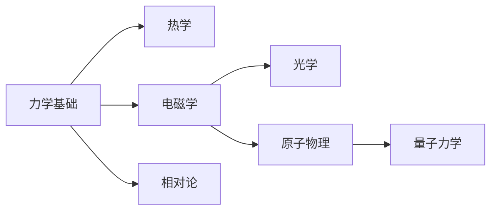

# 物理学

物理学是研究物质、能量以及它们之间相互作用的自然科学。从微观的量子世界到宏观的宇宙尺度，物理学帮助我们理解自然界的基本规律。

## 学科体系

### 基础物理

- **力学**：研究物体的运动和相互作用
- **热学**：探讨热现象和能量转换
- **声学**：研究声波的产生、传播和接收

### 进阶物理

- **电磁学**：电场、磁场及其相互作用
- **光学**：光的本质、传播和应用
- **原子物理**：原子结构和性质

### 现代物理

- **相对论**：时空的本质和引力理论
- **量子力学**：微观世界的规律

## 学习建议

1. **打好基础**：从经典力学开始，逐步深入
2. **理论与实践结合**：通过实验加深理解
3. **数学工具**：掌握必要的数学知识
4. **思维训练**：培养物理思维和问题解决能力

## 推荐学习路径

